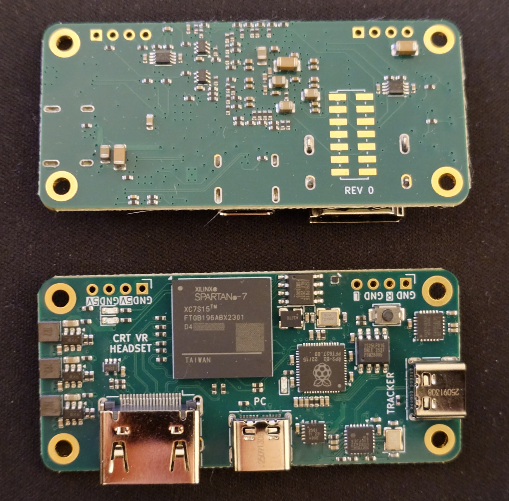

# Composite-VR-PCB

This repository contains the hardware design of a controller board for CRT-based VR headset. The circuit contains an AMD Spartan 7 FPGA which splits the incoming HDMI video into separate luma only (black-and-white) NTSC composite video signals for the left and right eye. It also contains an RP2040 microcontroller which serves two purposes:

1. Act as a JTAG programmer for the FPGA using [xvc-pico](https://github.com/kholia/xvc-pico)
2. Transmit 3-DOF tracking data back to a PC using the on-board IMU (based on [Relativty](https://github.com/relativty/Relativty)).

The board also contains a USB hub and a USB C port intended to be connected to a Vive Tracker. When a Vive tracker is connected and SteamVR settings are configured to use the Vive Tracker to [override the default tracking](https://github.com/ValveSoftware/openvr/wiki/TrackingOverrides), the onboard IMU  tracking will not be used, and the RP2040 will only serve to let SteamVR know that the headset is connected. 

The board is the same dimensions and has the same mounting hole placement as a Raspberry Pi Zero.

